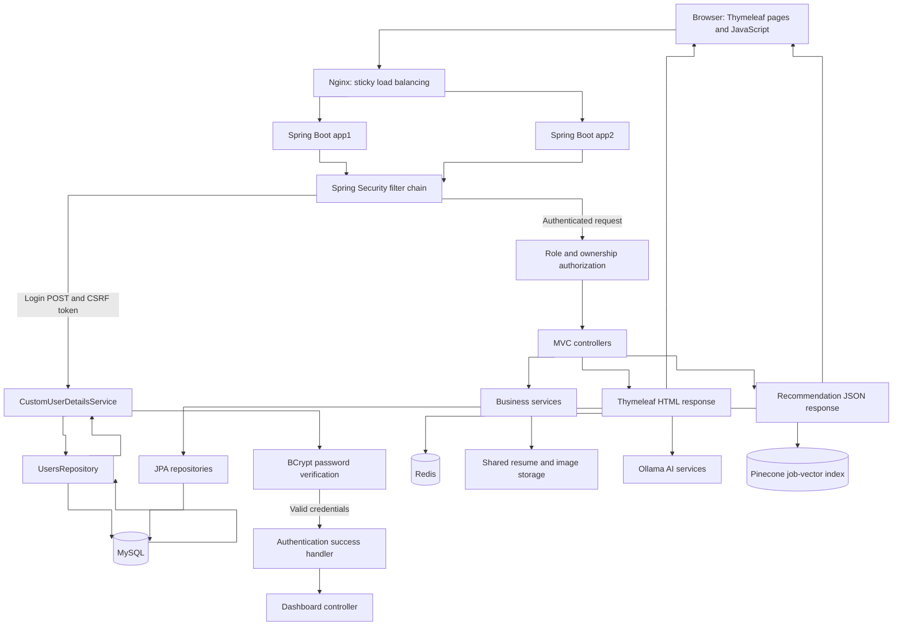
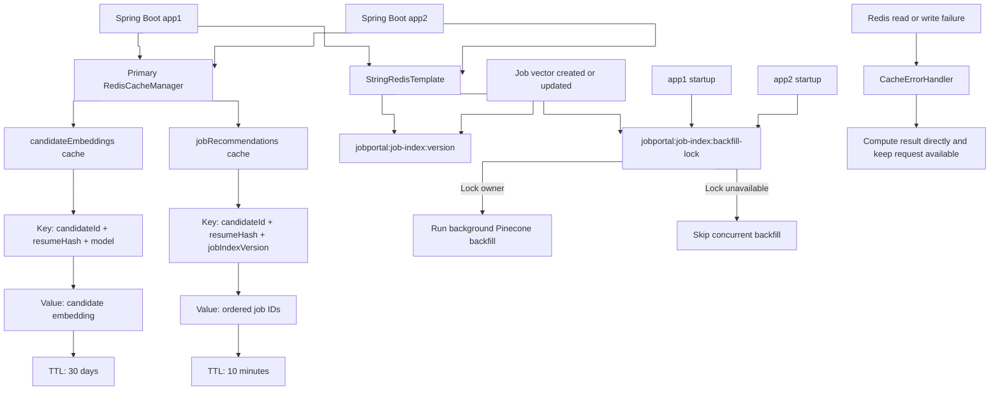
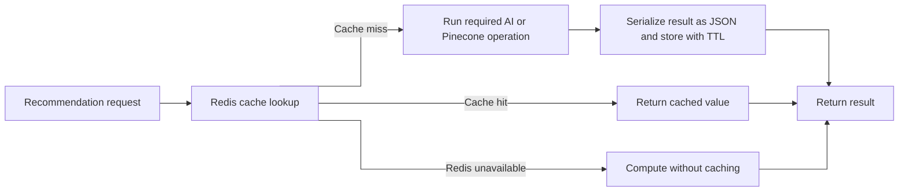
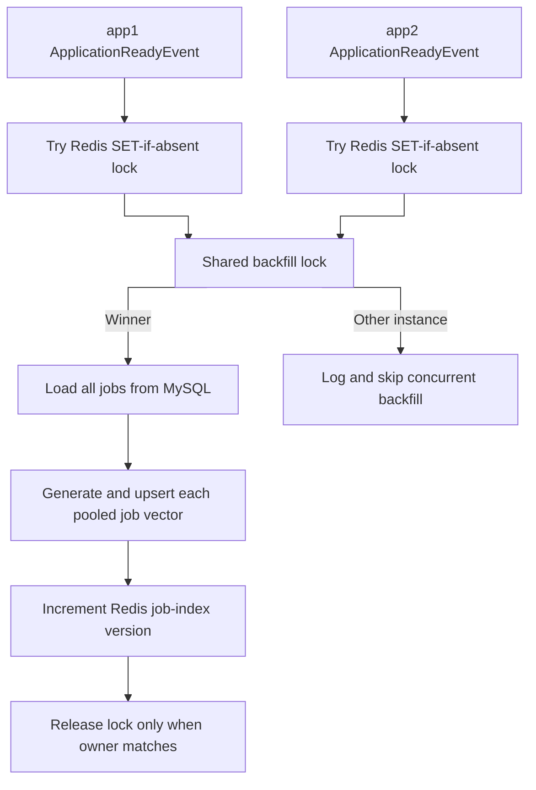

# Job Portal Application

A full-stack job portal that connects job seekers and recruiters. Recruiters can publish and manage jobs, while job seekers can search, save, apply, maintain a profile, upload a resume, and receive AI-powered job recommendations.

The application is built as a Spring Boot modular monolith and can run as multiple application instances behind Nginx. MySQL remains the source of truth, Redis provides shared caching and coordination, Ollama performs local AI inference, and Pinecone provides semantic job-vector search.

## Main features

### Job seekers

- Register and authenticate securely.
- Search and filter available jobs.
- View, save, and apply for jobs.
- Maintain a profile with skills, photo, and PDF resume.
- Receive asynchronous semantic job recommendations.

### Recruiters

- Maintain a recruiter profile.
- Create and edit owned job postings.
- View applicants for posted jobs.
- Automatically index job content in Pinecone.

### Platform

- Role-based authorization with Spring Security.
- CSRF-protected form actions and BCrypt password hashing.
- MySQL persistence through Spring Data JPA.
- Redis-backed AI result caching.
- Multi-instance startup coordination with a Redis lock.
- Docker Compose support for two application instances, Redis, and Nginx.

## Application architecture

All diagrams use straight, right-angle connectors to show the execution order clearly.

### Request, login, and service flow



After authentication, Spring Security sends both recruiter and job-seeker requests through the same controller-service-repository layers. Role rules determine which workflows are available. MySQL handles persistent business data, while Redis, Ollama, Pinecone, and shared files support the recommendation subsystem.

### Component responsibilities

| Component | Responsibility |
|---|---|
| Thymeleaf and JavaScript | Render server-side pages and load recommendations asynchronously. |
| Spring Security | Authentication, role authorization, CSRF protection, and session management. |
| Controllers and services | Execute job portal workflows and orchestrate recommendation processing. |
| MySQL | Store users, profiles, jobs, skills, applications, and saved jobs. |
| Resume storage | Store uploaded PDF resumes and profile images in the shared `photos` directory. |
| Ollama | Summarize resumes with `llama3.2` and create vectors with `mxbai-embed-large`. |
| Pinecone | Store one pooled vector per job and return semantically similar job IDs. |
| Redis | Cache candidate embeddings and recommendation IDs, store the job-index version, and coordinate startup backfill. |
| Nginx | Distribute browser traffic between two Spring Boot containers using sticky routing. |

## Redis architecture

Both application instances use the same Redis server. This lets a value computed by one instance be reused by the other instance and provides one coordination point for job-index changes and startup backfill.



### Redis cache flow



| Redis cache or key | Purpose | Lifetime |
|---|---|---|
| `candidateEmbeddings` | Candidate embedding keyed by candidate, resume hash, and model. | 30 days |
| `jobRecommendations` | Ordered recommended job IDs keyed by candidate, resume hash, and job-index version. | 10 minutes |
| `jobportal:job-index:version` | Changes recommendation keys when job vectors change. | Persistent |
| `jobportal:job-index:backfill-lock` | Prevents simultaneous startup backfill by multiple instances. | 30-minute lease |

## AI pipeline architecture

The application has two related AI pipelines. Recruiter jobs are converted into vectors and stored in Pinecone. Candidate resumes are converted into a temporary search vector, cached in Redis, and used to search those job vectors.

### Recruiter job-indexing pipeline

```mermaid
%%{init: {"flowchart": {"curve": "stepAfter"}}}%%
flowchart LR
    Recruiter["Recruiter submits job form"] --> Security["Recruiter authorization and ownership check"]
    Security --> Controller["JobPostActivityController"]
    Controller --> JobService["JobPostActivityService"]
    JobService --> SaveJob["Save job"]
    SaveJob --> MySQL[(MySQL)]
    SaveJob --> BuildText["Combine title, description, type, remote, location, and company"]
    BuildText --> Chunks["Split text into chunks"]
    Chunks --> EmbeddingModel["Ollama mxbai-embed-large"]
    EmbeddingModel --> Pool["Mean-pool successful chunk vectors"]
    Pool --> Pinecone[("Pinecone: upsert vector by job ID")]
    Pinecone --> Version["Increment Redis job-index version"]
    Version --> Redirect["Redirect to recruiter dashboard"]
```



### Candidate recommendation pipeline

```mermaid
%%{init: {"flowchart": {"curve": "stepAfter"}}}%%
flowchart TB
    Dashboard["Dashboard HTML is rendered"] --> Fetch["Browser GET /dashboard/recommendations"]
    Fetch --> Authorization["Job Seeker authorization"]
    Authorization --> Profile["Load candidate profile from MySQL"]
    Profile --> Resume["Locate and validate resume PDF"]
    Resume --> Hash["Calculate SHA-256 resume fingerprint"]
    Hash --> EmbeddingLookup["Redis candidate embedding lookup"]

    EmbeddingLookup -->|Hit| CandidateEmbedding["Candidate embedding"]
    EmbeddingLookup -->|Miss| PDFBox["PDFBox text extraction"]
    PDFBox --> Summary["Ollama llama3.2 technical summary"]
    Summary --> Embed["Ollama mxbai-embed-large"]
    Embed --> CacheEmbedding["Cache embedding in Redis for 30 days"]
    CacheEmbedding --> CandidateEmbedding

    CandidateEmbedding --> JobVersion["Read Redis job-index version"]
    JobVersion --> RecommendationLookup["Redis recommendation-ID lookup"]
    RecommendationLookup -->|Hit| RankedIds["Ordered job IDs"]
    RecommendationLookup -->|Miss| VectorSearch["Query Pinecone top 5"]
    VectorSearch --> CacheIds["Cache ordered IDs in Redis for 10 minutes"]
    CacheIds --> RankedIds

    RankedIds --> JobRepository["Load current jobs from MySQL"]
    JobRepository --> RestoreOrder["Restore Pinecone ranking order"]
    RestoreOrder --> Payload["Structured recommendation JSON"]
    Payload --> Render["JavaScript renders recommendation cards"]
```



### Reload behavior

For an unchanged resume and job index, both Redis lookups are cache hits. The application still validates and fingerprints the resume and loads current job records from MySQL, but it does not parse the PDF, call Ollama, or query Pinecone again.

## Multi-instance startup and backfill



This lock prevents concurrent backfill. A completed-backfill version marker is still planned so that an instance starting much later also knows the same backfill has already completed.

## Technology stack

- Java 21
- Spring Boot 4
- Spring MVC and Thymeleaf
- Spring Security
- Spring Data JPA and Hibernate
- Spring Data Redis
- Spring AI with Ollama
- PDFBox
- Pinecone Java client
- MySQL
- Redis 7
- Docker Compose and Nginx
- Bootstrap and JavaScript
- Maven

## Project structure

```text
src/main/java/com/luv2code/jobportal
|-- config       Security, Pinecone, MVC, and Redis configuration
|-- controller   MVC routes and recommendation endpoint
|-- entity       JPA entities and view projections
|-- repository   Spring Data JPA repositories
|-- services     Business, AI, caching, and indexing services
`-- util         Authentication and file utilities

src/main/resources
|-- templates    Thymeleaf pages
|-- static       CSS, JavaScript, fonts, and images
`-- application.properties
```

## Local setup

### Prerequisites

- Java 21
- MySQL with the existing `jobportal` database
- Redis
- Ollama with `llama3.2` and `mxbai-embed-large`
- A Pinecone index compatible with the embedding dimension
- A Pinecone API key supplied through `PINECONE_API_KEY`

Do not store API keys or production passwords in source control. Supply them through environment variables or a secret manager.

### Start Redis

```bash
docker compose up -d redis
```

### Run Spring Boot locally

```bash
./mvnw spring-boot:run
```

On Windows PowerShell:

```powershell
.\mvnw.cmd spring-boot:run
```

The local application is available at `http://localhost:8080`.

## Multi-instance Docker setup

Build the application JAR before building the image because the Dockerfile copies the packaged artifact from `target`.

```bash
./mvnw clean package -DskipTests
docker compose up --build
```

Available endpoints:

- `http://localhost:8081` - app1
- `http://localhost:8082` - app2
- `http://localhost` - Nginx load balancer

The Docker applications connect to the host MySQL and Ollama services through `host.docker.internal`. Redis runs inside the Compose network with persistent AOF storage and an authenticated health check.

## Planned improvements

- Record a completed-backfill version so a later instance does not repeat the same completed startup backfill.
- Move job indexing to a durable outbox and background worker with retries.
- Add hybrid keyword and vector ranking with calibrated relevance scores.
- Add cross-instance single-flight protection for simultaneous cache misses.
- Use shared Redis-backed sessions and object storage for multi-host deployment.
- Use managed Redis TLS, high availability, backups, monitoring, and secret management in production.
- Expand automated unit, integration, security, and load tests.

## Repository

[github.com/dexesh/JobPortal](https://github.com/dexesh/JobPortal)

## Contact

- GitHub: [github.com/dexesh](https://github.com/dexesh)
- LinkedIn: [Devesh Choubey](https://www.linkedin.com/in/devesh-choubey-063022220/)

## License

This project is intended for educational and learning purposes.
